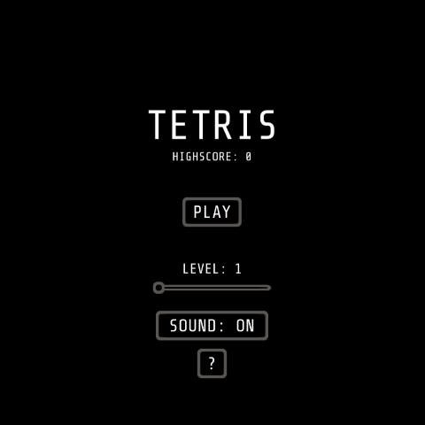

 
Tetris, developed at Unity.

## 📑 Index

- [📜 About](#-about)
- [💻 Technology](#-technology)
- [💡 Features](#-features)
- [📦 Builds](#-builds)

## 📜 About

This version of the famous [Tetris](https://tetris.com/), was developed as a test for [Kokku Games](http://www.kokkuhub.com/home/). A simple [reference](http://htmltetris.com/) was passed, and some requirements.

## 💻 Technology

- C#
- Unity ([LTS 2019.4.1f1](https://unity3d.com/pt/unity/qa/lts-releases?version=2019.4))

## 💡 Features

In my implementation, I chose to try to follow the specifications of [Tetris Guideline](https://tetris.wiki/Tetris_Guideline).

The implemented rules were:

- Super Rotation System
- Tetromino starting positions (21 and 22 rows)
- Lock Down (Infinity)
- Hold
- Piece preview
- Playfield (10 x 20)
- Piece colors
- Random Generator (Random bag)
- Ghost piece
- Timings (Marathon Gravity and Lock delay)
- Levels
- Music
- Game over (Top out)
- Scoring (only Single, Double, Triple and Tetris)

Additionally, a simple save system was implemented, with highscore and preference to turn off the sounds.

## 📦 Builds

The game is available on the following platforms:

- [🌐 Web (WebGL)](https://diegomoreira.dev/kokku-tetris/)

---

  
Developed by 🤘 Diego Moreira

   
  
  

